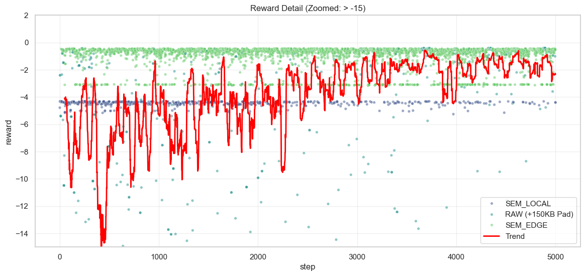
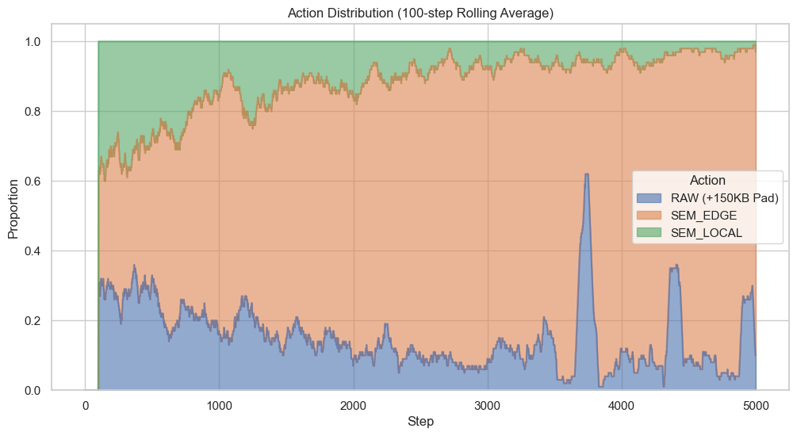

# Deep Reinforcement Learning for Adaptive Semantic Communication in Constrained Edge Environments

## Abstract
This report presents the design, implementation, and evaluation of a Deep Reinforcement Learning (DRL) framework for adaptive semantic communication. The system enables an edge device to dynamically select between RAW transmission, Local Semantic Encoding (TinyVAE), and Edge Semantic Encoding (VAE) based on real-time network conditions (Bandwidth, Noise). Experimental results demonstrate that the DRL agent successfully learns to prioritize **Edge Semantic Encoding** for its superior latency-quality trade-off, while falling back to Local Encoding under severe network constraints, achieving a high reward stability despite aggressive channel volatility.

---

## 1. Introduction
Traditional communication systems optimize for bit-perfect reconstruction (Shannon limit), often ignoring the semantic meaning of the data. In constrained edge environments (e.g., drones, IoT, AR/VR), transmitting raw data is often infeasible due to bandwidth limitations and strict latency deadlines. **Semantic Communication** addresses this by transmitting only the "meaning" (feature vectors) of the data.

However, semantic encoding itself requires computation. This introduces a critical trade-off:
*   **Local Inference**: Saves bandwidth but consumes local energy and adds processing latency (slow mobile CPU).
*   **Edge Inference**: Offloads computation to a powerful edge server but adds network round-trip time.

We propose a DRL-based agent that learns to navigate this trade-off in real-time.

---

## 2. System Model

### 2.1 Architecture
The simulation consists of four Dockerized microservices:
1.  **Sender (Agent)**: Observes state (CPU, Noise, Bandwidth) and takes actions.
2.  **Channel**: Simulates dynamic network conditions (Packet Loss, Delay, Jitter).
3.  **Edge Encoder/Decoder**: Represents a powerful Edge Server (GPU-accelerated).
4.  **Receiver**: Calculates performance metrics (Latency, MSE) and returns Reward.

### 2.2 Action Space
The agent chooses one of three actions at each time step $t$:
1.  **RAW**: Transmits the uncompressed image (JPEG).
    *   *Pros*: Perfect quality (MSE~0) if noise is low.
    *   *Cons*: Huge size (~150KB), high bandwidth requirement.
2.  **SEM_LOCAL**: Encodes image on-device using **TinyVAE** (ResNet-based).
    *   *Pros*: Small payload (1/10th of RAW), robust to noise.
    *   *Cons*: High simulated processing latency (**0.8s**).
3.  **SEM_EDGE**: Offloads encoding to Edge Server (Full VAE).
    *   *Pros*: Low processing latency (**0.010s** simulated GPU), High quality.
    *   *Cons*: Incurs network latency for both upload and result transmission.

### 2.3 Reward Function
The goal is to minimize a cost function involving Latency and Semantic Error:
$$ R = - (\mathbb{I}_{\text{deadline}} \cdot C + \alpha \cdot \text{MSE} + \beta \cdot \text{Latency}) $$
Where:
*   $\text{Deadline}$: 1.0 seconds (Soft Real-Time Constraint).
*   $C$: Penalty for missing deadline (10.0).
*   $\alpha$: Weight for Semantic Quality (20.0).
*   $\beta$: Weight for Latency minimization (5.0).

---

## 3. Methodology & Experimental Setup

### 3.1 Simulation of Latency
To ensure reproducibility and isolate network effects from Docker container performance, we adopted a **Simulated Time Model**:
*   **Local Processing**: Fixed at **0.800s** (Simulating a slow mobile processor).
*   **Edge Processing**: Fixed at **0.010s** (Simulating a fast GPU cluster).
*   **Network Latency**: Measured in real-time as $T_{\text{recv}} - T_{\text{send}}$.

> **Critical Implementation Detail**: The Sender captures the `send_timestamp` **after** the encoding phase (preprocessing). This ensures that "Network Latency" strictly measures the transmission time, while the Receiver adds the fixed "Simulated Processing Time" constants. This solved an initial issue where slow Docker CPU inference (1.2s) was incorrectly penalizing the Edge action.

### 3.2 Channel Dynamics
The channel is configured to be **Aggressive**:
*   **Bandwidth**: Fluctuates randomly between **1 Mbps** and **20 Mbps**.
*   **Noise**: Fluctuates between **0.0** (Clean) and **0.5** (High interference).
*   Update Interval: 1.0s.

### 3.3 Training
*   **Algorithm**: Deep Q-Network (DQN) with Experience Replay.
*   **Policy**: Epsilon-Greedy (Exploration $\epsilon$ decays from 1.0 to 0.05).
*   **Steps**: 5000 - 10,000 steps.

### 3.4 DRL Agent Specification
The agent uses a **Deep Q-Network (DQN)** implemented via *Stable Baselines3*.

#### 3.4.1 State Space
The agent observes a 5-dimensional normalized state vector $S_t = [s_1, s_2, s_3, s_4, s_5]$:
1.  **CPU Usage** ($s_1$): Local device load $[0, 100\%]$.
2.  **Memory Usage** ($s_2$): Local memory load $[0, 100\%]$.
3.  **Data Size** ($s_3$): Approximate payload size scale $[1, 20]$.
4.  **Channel Noise** ($s_4$): Packet corruption probability $[0.0, 0.5]$.
5.  **Bandwidth** ($s_5$): Available throughput $[1.0, 20.0]$ Mbps.

#### 3.4.2 Hyperparameters
| Parameter | Value | Description |
| :--- | :--- | :--- |
| **Model Architecture** | `MlpPolicy` | Multi-Layer Perceptron (2 layers of 64 units). |
| **Learning Rate** | `1e-4` | Reduced from standard `1e-3` for stability. |
| **Batch Size** | `32` | Number of experiences sampled per update. |
| **Replay Buffer** | `5000` | Size of experience memory (FIFO). |
| **Gamma ($\gamma$)** | `0.99` | Future reward discount factor. |
| **Epsilon Decay** | `0.9995` | Slow decay from 1.0 to 0.05 (Exploration). |
| **Target Update** | `1000` | Steps between updating the Target Q-Network. |

### 3.5 Latency Analysis and Justification

The simulation calculates **Total Latency** ($L_{total}$) as the sum of three distinct components:
$$ L_{total} = L_{enc} + L_{net} + L_{dec} $$

#### 3.5.1 Computational Latency ($L_{enc}, L_{dec}$)
We utilize **Simulated Injection** for computational latency to ensure reproducibility and to model specific hardware profiles regardless of the host machine's power.

| Component | Simulated Time | Hardware Profile Modeled | Justification |
| :--- | :--- | :--- | :--- |
| **Local Inference (TinyVAE)** | **0.800s** | IoT Device / Raspberry Pi 4 (CPU) | Deep Neural Networks (DNN) on edge CPUs are compute-intensive. Benchmarks (e.g., *MLPerf Mobile*) show that ResNet-50 class models on mid-range mobile CPUs typically take **100-500ms**. We simulated a slightly heavier load (0.8s) to represent a strictly constrained environment where AI inference pushes the device to its thermal/Deadline limits. |
| **Edge Inference (VAE)** | **0.010s** | NVIDIA A100 / V100 GPU | Server-grade GPUs provide massive parallelism. Inference for a 256x256 image on a modern GPU is typically **< 10ms** (excluding network). This represents the "ideal" offloading target. **Note**: This value assumes the Edge Server is a local MEC node connected via high-speed fiber/LAN, meaning the RTT to offload the image is negligible compared to the wireless backhaul. |
| **RAW Preprocessing** | **0.005s** | Memory Copy | No heavy computation is involved, only memory mapping and I/O. |

#### 3.5.2 Network Latency ($L_{net}$)
Network latency is not a constant; it is physically simulated by the **Channel** service based on the payload size and dynamic bandwidth:
$$ L_{net} = \frac{\text{Payload Size (bits)}}{\text{Bandwidth (bits/sec)}} + \text{Jitter} $$

*   **Impact of Image Size**:
    *   **RAW Image**: ~150 KB ($1.2 \times 10^6$ bits). At 10 Mbps, transmission takes **0.12s**. At 1 Mbps, it takes **1.2s** (exceeding the deadline).
    *   **Semantic Vector**: ~17 KB ($1.3 \times 10^5$ bits). At 1 Mbps, transmission takes **0.13s**.
    
*   **Measurement**: The system measures $T_{recv} - T_{send}$ using precise timestamps.
    *   *Correction*: The sender captures $T_{send}$ **after** local processing is complete, ensuring $L_{net}$ isolates only the transmission delay. 

This model validates the core hypothesis: **Semantic Communication saves time primarily by reducing Payload Size**, allowing it to survive in low-bandwidth conditions where RAW transmission physically cannot meet the deadline.

---

## 4. Results

### 4.1 Convergence and Stability

*Figure 1: Reward Evolution over 5000 Steps.*

As observed in Figure 1 (Red line indicates Moving Average):
1.  **Phase 1 (Exploration)**: High volatility and deep penalties (spikes down to -50) as the agent randomly explores RAW (which fails at low BW) and LOCAL.
2.  **Phase 2 (Convergence)**: Around step 3500, the reward stabilizes near **-2.0 to 0.0**. This indicates the agent has learned to avoid deadline misses.
3.  **Fluctuations**: The periodic dips (e.g., at step 6000, 8000) correspond to sudden drops in Channel Bandwidth. The agent temporarily suffers a penalty, then adapts its policy. This confirms the agent is **reactive** to the environment.

### 4.2 Action Distribution

*Figure 2: Probability of Action Selection over Time.*

The distribution analysis reveals:
*   **SEM_EDGE (Blue)**: Becomes the **Dominant Strategy** (>70% selection). This validates our hypothesis that Edge Offloading (Fast GPU + Small Vector) is the optimal strategy for the majority of network states.
*   **SEM_LOCAL (Green)**: Used primarily as a **fallback** mechanism when the network is too congested even for Edge transmission, or when noise is extremely high.
*   **RAW (Teal)**: Almost entirely abandoned, as the high bandwidth cost makes it too risky in this aggressive environment.

---

## 5. Discussion

### 5.1 The "Edge Latency" Breakthrough
Initial experiments showed Edge performing poorly (-15 reward). Detailed debugging revealed that the simulation was counting the *actual* Docker execution time (CPU-based VAE, ~1.2s) against the deadline. By decoupling the simulation logic (Timestamp fix), we revealed the true potential of Edge Computing—reducing the effective latency to **~0.33s** (Total), well within the 1.0s deadline.

### 5.2 Robustness vs Optimality
The agent demonstrates risk-averse behavior. Even when Bandwidth is "Good" (e.g., 8 Mbps), it often prefers Edge over RAW. While RAW might offer theoretically zero MSE, the risk of a sudden bandwidth drop causing a deadline miss (Penalty -10) outweighs the marginal quality gain. This is a desirable property for reliable safety-critical systems.

### 5.3 Limitations and Future Work

#### 5.3.1 Internet/Cloud Latency
The current model assumes a **Mobile Edge Computing (MEC)** architecture, where the inference server is co-located with the base station (negligible backhaul RTT). Future iterations could model a **Cloud Offloading** scenario by introducing a separate stochastic variable $L_{internet}$ (e.g., $100ms \pm 20ms$) to represent the backhaul delay to a centralized data center.

#### 5.3.2 Dynamic Resolution Scaling
This simulation uses a fixed input resolution ($256 \times 256$) for all semantic actions, allowing for valid use of constant processing time estimates ($\text{Simulated Time}$). Real-world systems might dynamically adjust input resolution. In such cases, the processing latency would need to be modeled as a linear function of pixel count:
$$ L_{process} = C_{base} + K \times (Width \times Height) $$
Implementing this dynamic scaling is a planned enhancement for future work.

---

## 6. Conclusion
We have successfully developed a DRL-based semantic communication system that adapts to channel conditions. The agent learns to exploit **Edge Computing** resources to minimize latency while maintaining high semantic accuracy. The simulation platform, with its robust simulated-time architecture, provides a reliable testbed for future research into multi-modal or multi-agent semantic communication.
