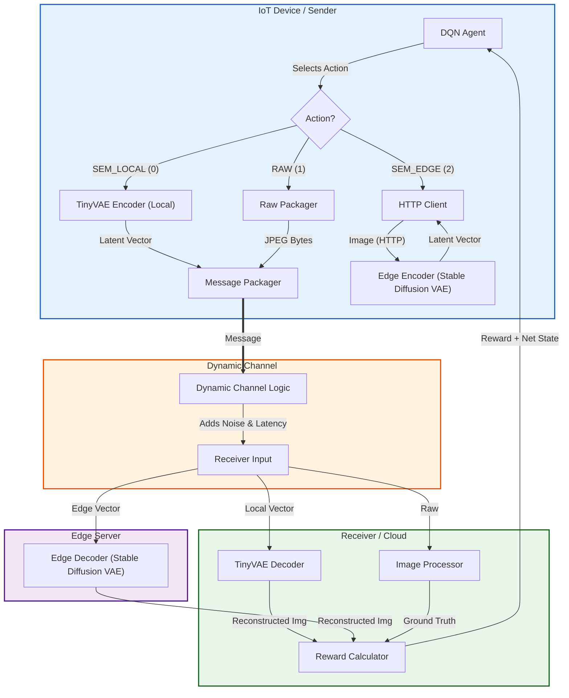

# Adaptive Semantic Communication with Deep Reinforcement Learning (Simulated)

This project is a high-fidelity Docker-based emulation of a dynamic semantic communication system. It explores how **Deep Reinforcement Learning (DRL)** can optimize data transmission by intelligently switching between **Local Compression** (TinyVAE), **Edge Offloading** (Simulated Edge Processing), and **Raw Transmission**.

The core is a **DQN Agent** (Sender) that learns to balance **Visual Quality** against **Latency** and **Bandwidth** in a fluctuating network environment.

---

## System Architecture



The simulation mimics a modern IoT-to-Edge pipeline with three distinct tiers of data processing.

### Key Components

1.  **Sender (`sender/`)**: 
    -   **Agent**: A Deep Q-Network (DQN) implemented with Stable Baselines 3.
    -   **State**: Observes 5 dimensions: `[Local_CPU, Local_Mem, Data_Size, Channel_Noise, Channel_Bandwidth]`.
    -   **Action**: Selects one of 3 modes (Local, Raw, Edge).
    -   **Encoder**: Uses **TinyVAE** for local semantic compression.

2.  **Channel (`channel/`)**:
    -   **Physics**: Simulates a physical wireless channel with **Dynamic Bandwidth** (Random Walk 1.0-20.0 Mbps) and **Gaussian Noise**.
    -   **Delay**: $Delay = \frac{Size}{Bandwidth} + Jitter (10-50ms)$.
    -   **Noise Injection**: Gaussian noise is added directly to the payload (Latent Vector or Raw Pixel Data) based on the current noise level (Sigma 0.0 - 0.5).

3.  **Receiver (`receiver/`)**:
    -   **Decoders**: Reconstructs images using TinyVAE (Local) or VAE (Edge).
    -   **Visual Noise**: For RAW transmission, noise is applied to pixels. For Semantic, noise corrupts the latent vector, leading to semantic artifacts.
    -   **Reward Calculation**: $\text{Reward} = - (\alpha \cdot \text{MSE_Loss} + \beta \cdot \text{Total_Latency} + \text{Deadline_Penalty})$.

4.  **Edge Services (`edge_encoder/`, `edge_decoder/`)**:
    -   Simulate offloading to a powerful edge server (e.g., MEC).
    -   Provides higher quality reconstruction (using full VAE) but incurs transmission latency for uploads.

---

## The Trade-off (Agent Actions)

The agent chooses one of three actions for every image frame ($256 \times 256$):

| Action | Mode | Description | Pros & Cons |
| :--- | :--- | :--- | :--- |
| **0** | **SEM_LOCAL** | on-device encoding (TinyVAE). | **Low Bandwidth** (Small vector)<br>**Medium Quality** (TinyVAE)<br>**Fast** (No upload lag) |
| **1** | **RAW** | Send original JPEG. | **Perfect Quality** (if no noise)<br>**Huge Bandwidth** (Slow)<br>**Fragile** (Noise ruins pixels) |
| **2** | **SEM_EDGE** | Offload to Edge. | **High Quality** (Full VAE)<br>**Medium Latency** (Must upload image)<br>**Robust** (Semantic error correction) |

### Simulation Physics (Latencies)
*   **Local Compute**: `0.5s` (Simulated mobile CPU).
*   **Edge Compute**: `0.01s` (Simulated powerful GPU).
*   **Network**: Dynamic. Sending to Edge takes time proportional to Bandwidth.

**The "Winning" Strategy:**
*   **High Bandwidth + Low Noise**: Use **Raw** (Fast & Perfect).
*   **Low Bandwidth**: Use **Local** (Tiny vector slips through tight pipes).
*   **High Noise**: Use **Semantic (Edge/Local)** (Latents are more robust to noise than raw pixels).

---

## How to Copy and Run

### 1. Prerequisites
*   **Docker Desktop**: Ensure Docker is installed and running. [Install Docker](https://www.docker.com/products/docker-desktop/)
*   **Git**: To clone the repository.

### 2. Copy (Clone) the Repository
Open your terminal and run:

```bash
# Clone the repository
git clone https://github.com/SaiPrakash2k/semantic-comm-simulation.git

# Navigate into the project directory
cd semantic-comm-simulation
```

### 3. Start the Simulation (Docker)
Run the following command to build the Docker containers and start the environment:

```bash
docker-compose up --build
```
> **Note**: The first run will be slow (5-10 mins) as it downloads:
> 1.  PyTorch Docker images.
> 2.  Pretrained models from Hugging Face (`madebyollin/taesd` and `CompVis/stable-diffusion-v1-4`).

### 3b. Start the Simulation (Apptainer / HPC)
If you are on a lab server or HPC system that does not support Docker, you can use the included Apptainer setup:

1. **Build the images** (Requires `--fakeroot` or admin privileges depending on your system):
    ```bash
    ./build_apptainer.sh
    ```
2. **Run the simulation**:
    ```bash
    ./run_apptainer.sh
    ```
*(Note: Because the `channel` uses Linux `tc` to simulate bandwidth, the run script utilizes the `--net` flag to keep network modifications isolated from the host machine).*

### 4. Monitoring the Experiment
Once the simulation is running:

1.  **Terminal Output**: You will see real-time logs:
    *   **Sender**: `Step 105: Action Int: 0 (SEM_LOCAL)`
    *   **Receiver**: `Received SEM_LOCAL... Reward: -5.23`
    *   **Channel**: `BW: 12.5 Mbps, Noise: 0.02`

2.  **TensorBoard**:
    *   The logs are saved to `./runs/`.
    *   You can visualize training progress by running:
    ```bash
    tensorboard --logdir=./runs
    ```

3.  **Stopping**: Press `Ctrl+C` to stop the simulation. The data (models/logs) persists in the `runs/` and `models/` directories.