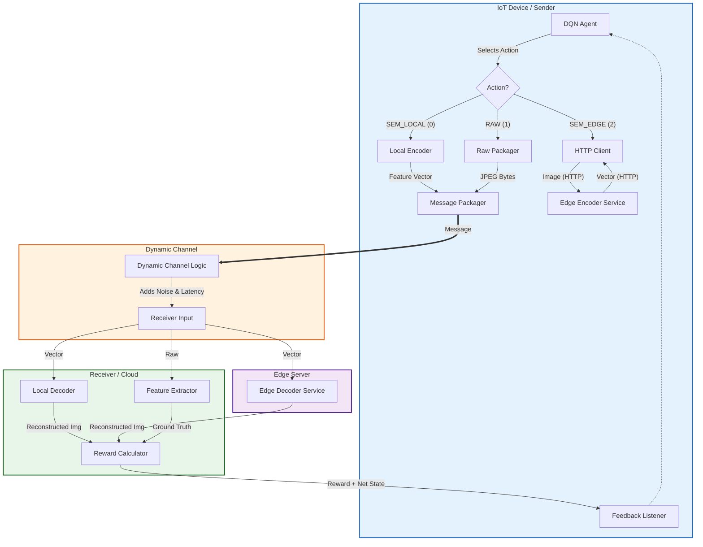

# Adaptive Semantic Communication with Deep Reinforcement Learning

This project is a Docker-based emulation of a dynamic semantic communication system. It explores how **Deep Reinforcement Learning (DRL)** and **Edge Computing** can work together to optimize data transmission in fluctuating network conditions.

The core of the project is a DRL agent (living in the **Sender**) that learns an optimal policy for data transmission. It continuously decides the best strategy—local compression, edge offloading, or raw transmission—based on real-time **local resources** (CPU, memory) and **channel conditions** (noise, bandwidth).

---

## 🏛️ System Architecture

The simulation mimics an IoT-to-Edge-to-Cloud pipeline:



---

## 🧩 Core Components

### 1. `Sender` (The Agent)
*   **Role:** The intelligent decision-maker.
*   **Agent:** A **DQN (Deep Q-Network)** agent trained using `stable-baselines3`.
*   **Observations ($S_t$):** A 5D vector representing:
    *   `cpu_load`: Current local CPU usage (%).
    *   `memory_load`: Current local RAM usage (%).
    *   `data_size`: Size of the transmission task.
    *   `channel_noise`: Last known noise level (sigma).
    *   `channel_bandwidth`: Last known channel speed (Mbps).
*   **Actions ($A_t$):**
    *   `0: SEM_LOCAL`: Compress image locally (High CPU, Low Bandwidth).
    *   `1: RAW`: Send raw image (Low CPU, High Bandwidth, Perfect Quality).
    *   `2: SEM_EDGE`: Offload compression to Edge container (Low CPU, Low Bandwidth, Extra Latency).

### 2. `Edge Services` (The Helper)
*   **Role:** Simulates a Mobile Edge Computing (MEC) server.
*   **`edge-encoder`:** A FastAPI service that accepts images and returns semantic vectors.
*   **`edge-decoder`:** A FastAPI service that accepts vectors and returns reconstructed images (for the receiver).

### 3. `Channel` (The Environment)
*   **Role:** Simulates the physical transmission medium.
*   **Dynamics:** Continuously varies `noise` (0.0 - 0.5) and `bandwidth` (1.0 - 20.0 Mbps) using a random walk.
*   **Simulation:**
    *   Delays packets based on `size / bandwidth`.
    *   Corrupts "Semantic" packets by adding Gaussian noise.
    *   Forwards the packet + current network state to the Receiver.

### 4. `Receiver` (The Judge)
*   **Role:** Calculates the system performance.
*   **Logic:**
    *   Decodes the received message (using Local Decoder or Edge Decoder service).
    *   Compares the result against the Ground Truth (sent alongside for simulation purposes).
    *   **Reward Function:** $R = -(\text{LatencyPenalty} + \alpha \times \text{MSE\_Loss})$.
    *   Sends this reward back to the Sender to update the DQN.

---

## 🚀 How to Run

### Prerequisites
*   Docker & Docker Compose

### 1. Pre-train the Autoencoder (Crucial!)
The semantic communication relies on a trained Autoencoder. If you don't have one, the semantic actions will produce garbage, and the agent will learn to hate them.

Run the training script (using the container is recommended):
```bash
docker-compose run --rm --build sender python train_dual_models.py
```
This produces the following weight files in `./models/`:
*   `mobilenet_encoder.pth` & `simple_decoder.pth` (Local)
*   `resnet_encoder.pth` & `complex_decoder.pth` (Edge)

### 2. Start the Simulation
From the root directory:

```bash
docker-compose up --build
```

**Configuration:**
 You can change the experiment duration by editing `docker-compose.yml` or setting the variable inline:
```bash
EXPERIMENT_STEPS=500 docker-compose up --build
```

### 3. Watch it Learn 🧠
You will see logs from all services.
*   **Step 0-100:** Exploration buffer filling (Agent acts randomly).
*   **Step 101+:** Training begins. Watch the `Action` and `Reward`.
    *   In **high noise**, the agent should prefer `RAW`.
    *   In **low bandwidth**, the agent should prefer `SEM_LOCAL` or `SEM_EDGE`.
    *   When **CPU is high**, it should start preferring `SEM_EDGE` or `RAW`.

---

## 🛠️ Troubleshooting

*   **Crash at Step 101?** ensure you have the latest code fixes (DummyEnv return values).
*   **Agent always chooses RAW?** This usually means the model weights are missing (check `./models/`).
*   **Connection Refused?** Ensure all containers (`edge-encoder`, `channel`, etc.) are fully healthy before the Sender starts its loop.