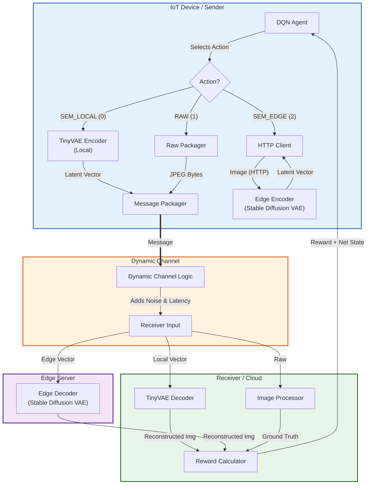

# Adaptive Semantic Communication with Deep Reinforcement Learning (Simulated)

This project is a high-fidelity Docker-based emulation of a dynamic semantic communication system. It explores how **Deep Reinforcement Learning (DRL)** can optimize data transmission by intelligently switching between **Local Compression** (TinyVAE), **Edge Offloading** (Stable Diffusion), and **Raw Transmission**.

The core is a **DQN Agent** (Sender) that learns to balance **Visual Quality** against **Latency** and **Bandwidth** in a fluctuating network environment.

---

## 🏛️ System Architecture

The simulation mimics a modern IoT-to-Edge pipeline with three distinct tiers of data processing:



---

## ⚖️ The Trade-off (Agent Actions)

The agent chooses one of three actions for every image frame ($256 \times 256$):

| Action | Component | Description | Trade-offs |
| :--- | :--- | :--- | :--- |
| **0: SEM_LOCAL** | **TinyVAE (TAESD)** | Compresses image on the device (Sender). | ✅ **Fast Encoding** (Simulated Mobile CPU)<br>⚠️ **Medium Quality** (Slight compression artifacts)<br>✅ **Low Bandwidth** |
| **1: RAW** | **None** | Sends the original image. | ✅ **Perfect Quality**<br>❌ **Massive Bandwidth** (High latency if network is slow)<br>❌ **Vulnerable to Noise** |
| **2: SEM_EDGE** | **SD VAE** | Uploads image to Edge for high-quality compression. | ✅ **Excellent Quality** (Stable Diffusion VAE)<br>✅ **Fast Compute** (Simulated GPU)<br>❌ **Upload Latency** (Using bandwidth to upload) |

### Simulation Physics (Latencies)
*   **Local Compute**: `0.5s` (Simulating a slow mobile processor).
*   **Edge Compute**: `0.01s` (Simulating a powerful GPU cluster).
*   **Network**: Dynamic. Sending to Edge takes time proportional to Bandwidth.

**The "Winning" Strategy:**
*   **High Bandwidth**: Use **Edge**. (Fast Upload + Instant Compute + Great Quality).
*   **Low Bandwidth**: Use **Local**. (Upload takes too long; Local compute is slow but quicker than bad network).
*   **Very High Bandwidth + No Noise**: Use **Raw**.

---

## 🚀 How to Run

### Prerequisites
*   Docker & Docker Compose
*   (Optional) NVIDIA GPU for Edge containers (defaults to CPU, which is fine for simulation).

### Start the Simulation
From the root directory:

```bash
docker-compose up --build
```

**Note**: The first run will be slow because the **Sender** and **Edge** containers need to download the pretrained models (`madebyollin/taesd` and `CompVis/stable-diffusion-v1-4`) from Hugging Face.

### Watch it Learn 🧠
You will see logs from all services.
1.  **Exploration (Step 0-100)**: The agent acts randomly to fill its replay buffer.
2.  **Training (Step 101+)**: The agent starts learning.
    *   Watch the `Analysis` logs or check `runs/` for TensorBoard/Plots.
    *   Ideally, the agent converges to **Local** or **Edge** depending on the simulated channel conditions.

---

## 🛠️ Components

### 1. `Sender` (The Agent)
Hosted in `sender/`. Runs the PyTorch DRL agent (`stable-baselines3` DQN). It observes CPU load, memory, and channel feedback to pick an action.

### 2. `Edge Services`
Hosted in `edge_encoder/` and `edge_decoder/`. These are FastAPI microservices that host the heavy **Stable Diffusion VAE**.

### 3. `Channel`
Hosted in `channel/`. A simulated network pipe that injects Gaussian noise and delays packets based on their size and the current "Simulated Bandwidth" (which fluctuates randomly).

### 4. `Receiver`
Hosted in `receiver/`. Receives messages, decodes them (using TinyVAE or calling the Edge Decoder), compares the result to the Ground Truth (MSE Loss), and calculates the **Reward**.